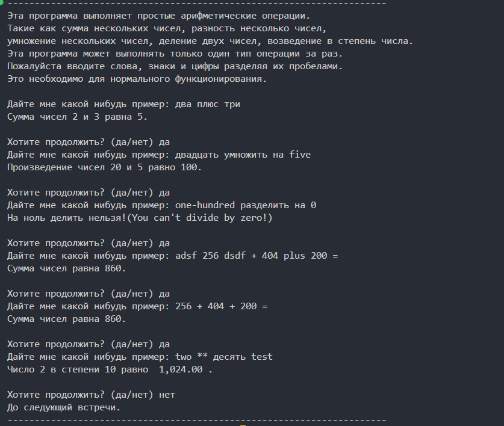

# 🧮 Умный калькулятор с естественным вводом

Проект демонстрирует эволюцию от монолитной архитектуры к модульному подходу.
 
## 📖 Оглавление
- [Возможности](#возможности)
- [Примеры использования](#примеры-использования)
- [Ограничения](#ограничения)
- [Установка](#установка)
- [Скриншоты](#скриншоты)
- [Лизензия](#лизензия)
- [Структура проекта](#структура-проекта)

## 📜 Возможности
- ✅ Распознает числа в разных форматах (слова, цифры)
- ✅ Поддерживает основные операции: +, -, *, /, **
- ✅ Игнорирует "мусор" в вводе
- ✅ Модульная архитектура (версия 2.0)
- ✅ Чистый и читаемый код

## 💡 Примеры использования
```
Ввод: "два плюс три"
Вывод: 5

Ввод: "двадцать умножить на five"
Вывод: 100

Ввод: "one-hundred разделить на 0"
Вывод: На ноль делить нельзя!

Ввод: "256 + 404 + 200 = "
Вывод: 860

Ввод: "two ** десять test "
Вывод: 1024
```

## 🏴‍☠️ Ограничения
- ❌ Поддерживает только одну операцию за раз
- ❌ Требует разделения элементов пробелами
- ❌ Слова обозначающие числа должны быть от 0 до 100
- ❌ Не поддерживает скобки и приоритет операций

## 🛠️ Установка и запуск

### Версия 2.0 (Рекомендуется)
```bash
cd version_02
python main.py
```

### Версия 1.0 (Историческая)
```bash
cd version_01
python calculator_monolith.py
```

## 📸 Скриншоты


## 📄 Лизензия

Этот проект распространяется под **лизензией MIT** - одной из самых разрешительных open-source лицензий.

### Файлы лицензии:
- **[LICENSE](LICENSE)** - оригинальная версия на английском языке (имеет юридическую силу)
- **[LICENSE.ru](LICENSE.ru)** - перевод на русский язык (для удобства ознакомления)

### Что это значит:
- ✅ Вы можете свободно использовать, модифицировать и распространять код
- ✅ Можно использовать в коммерческих проектах
- ✅ Обязательное условие: указание авторства
- ❌ Автор не несет ответственности за возможные проблемы

*Для юридических целей следует руководствоваться английской версией лицензии.*

## 📂 Структура проекта
```
calculator/
/---version_01/           # Монолитная версия
/   /---calculator_monolith.py
/---version_02/           # Модульная версия
/   /---main.py
/   /---analyze_sent.py
/   /---get_objects.py
/   /---operations.py
/   /---perform_opr.py
/---images/               # Скриншоты
/   /---calculator-demo.png
/---README.md
/---.gitignore
/---LICENSE               # Английская версия
/---LICENSE.ru            # Русская версия

## 🔄️ История изменений
- **v2.0** - Модульная архитектура, улучшенная обработка ошибок
- **v1.0** - Первоначальная монолитная версия
